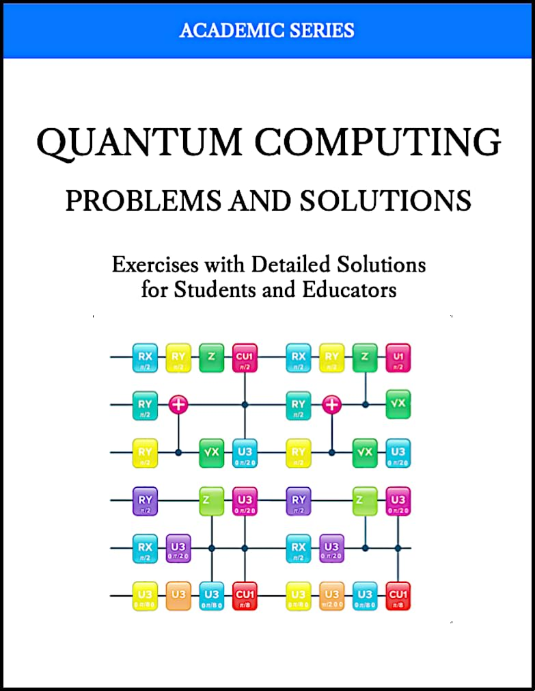

# QCICT Quantum Computing Course
Course materials and presentations for the QCICT Quantum Computing Course.

The course builds on quantum computing courses taught by Prof. Aleksandar Radovanovic at the University of the Western Cape in Cape Town and the School of Computing, Union University in Belgrade. It continues to evolve through teaching experience and advances in quantum computing.

## Course Presentations

| Lecture | Presentation |
|---|---|
| 1. Introduction to Quantum Computing | [Download ](https://raw.githubusercontent.com/Quantum-Computing-Institute-Cape-Town/Quantum-Computing-Course/main/Presentations/01-Introduction.pptx)|
| 2. Mathematical Foundation | [Download ](https://raw.githubusercontent.com/Quantum-Computing-Institute-Cape-Town/Quantum-Computing-Course/main/Presentations/02-Mathematical-foundation.pptx) |
| 3. Qubit | [Download ](https://raw.githubusercontent.com/Quantum-Computing-Institute-Cape-Town/Quantum-Computing-Course/main/Presentations/03-Qubit.pptx) |
| 4. Quantum Gates | [Download ](https://raw.githubusercontent.com/Quantum-Computing-Institute-Cape-Town/Quantum-Computing-Course/main/Presentations/04-Quantum%20gates.pptx) |
| 5. Quantum Circuits | [Download ](https://raw.githubusercontent.com/Quantum-Computing-Institute-Cape-Town/Quantum-Computing-Course/main/Presentations/05-Quantum%20Circuits.pptx) |
| 6. Quantum Communications | [Download ](https://raw.githubusercontent.com/Quantum-Computing-Institute-Cape-Town/Quantum-Computing-Course/main/Presentations/06-Quantum%20communications.pptx) |
| 7. Quantum Cryptography | [Download ](https://raw.githubusercontent.com/Quantum-Computing-Institute-Cape-Town/Quantum-Computing-Course/main/Presentations/07-Quantum%20cryptography.pptx) |
| 8. Elements of Quantum Algorithms | [Download ](https://raw.githubusercontent.com/Quantum-Computing-Institute-Cape-Town/Quantum-Computing-Course/main/Presentations/08-Elements%20of%20Quantum%20Algorithms.pptx) |
| 9. Quantum Algorithms (1) | [Download ](https://raw.githubusercontent.com/Quantum-Computing-Institute-Cape-Town/Quantum-Computing-Course/main/Presentations/09-Quantum%20algorithms%20%281%29.pptx) |
| 10. Quantum Algorithms (2) | [Download ](https://raw.githubusercontent.com/Quantum-Computing-Institute-Cape-Town/Quantum-Computing-Course/main/Presentations/10-Quantum%20algorithms%20%282%29.pptx) |
| 11. Quantum Machine Learning | [Download ](https://raw.githubusercontent.com/Quantum-Computing-Institute-Cape-Town/Quantum-Computing-Course/main/Presentations/11-Quantum%20machine%20learning.pptx) |

## Additional Materials

- Code-based exercises and practical examples are available in the [QC-Labs repository](https://github.com/Quantum-Computing-Institute-Cape-Town/QC-Labs/tree/main).

- For a deeper theoretical foundation, the accompanying book *Quantum Computing: Problems and Solutions* offers structured mathematical exercises that complement the practical labs.  
  ([Paperback](https://www.amazon.com/dp/B0FW6K3R3L) | [Kindle](https://www.amazon.com/dp/B0FW8P257M))

---
Quantum Computing Institute https://qcict.org | Contact alex@qcict.org